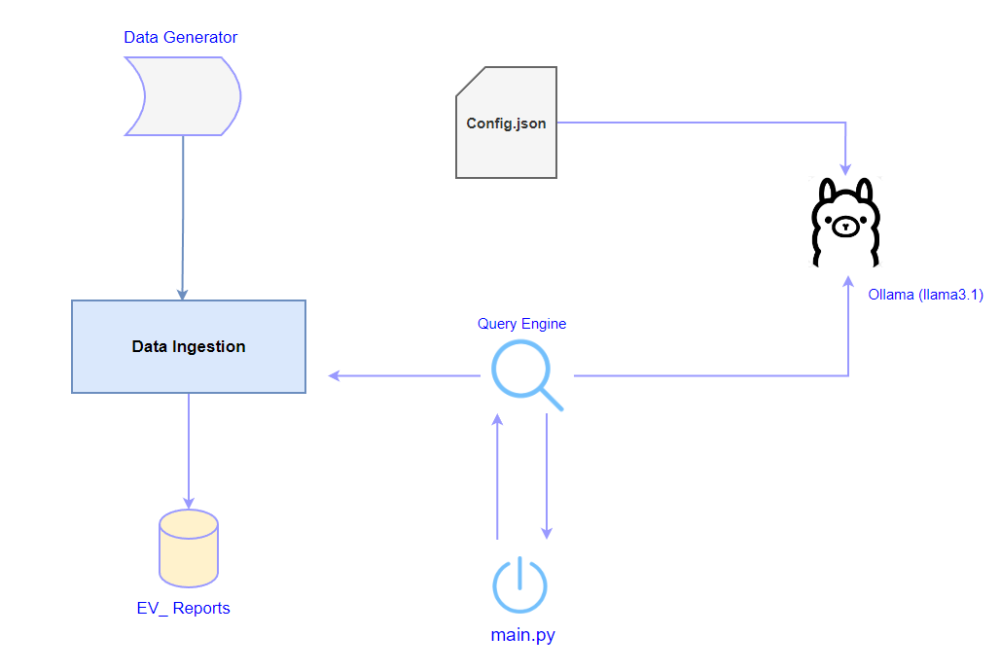

# Build_AI_Agent_To_Solve_Complex_Ques_Via_Decomposition_n_Aggregation
How To Build AI Agent To Solve Complex Question Using 'Decomposition and Aggregation'

# Let's Build ReAct AI Agent From Scratch


## Introduction

Full Article : [https://medium.com/@learn-simplified/lets-build-re-act-ai-agent-from-scratch-41263fd6a983

In the ever-evolving world of finance, the ability to quickly interpret data and make informed decisions is a game-changer. Imagine having an AI-powered assistant that can analyze stock prices, calculate financial ratios, and even gauge market sentiment - all in real-time. This article takes you on a journey to build just that: an intelligent financial agent that seamlessly blends AI with finance to deliver insights that matter. Whether you're curious about AI's potential in business or looking to sharpen your financial tools, this guide offers a unique, hands-on approach to making AI work for you.

## What's This Project About?
This article provides a comprehensive overview of building a financial analysis tool powered by AI. It explains the entire process, from setting up a financial agent to fetching and analyzing stock data, calculating financial ratios, and assessing market sentiment. By diving into the code and its functionality, readers will understand how different components work together to create a robust AI-driven solution. Whether you're a developer interested in AI applications or a business professional looking to understand how AI can enhance financial analysis, this article will guide you through the essentials.

## Why Use This Project?
Artificial intelligence is transforming industries, and the business sector is no exception. In today's competitive landscape, companies that effectively utilize AI to analyze data have a distinct advantage. This article shows how AI can be implemented within a business setting, specifically focusing on financial analysis. By exploring a fictional company's use of AI, the article demonstrates how to leverage technology for informed decision-making, making it a must-read for anyone interested in the intersection of finance and AI.

## Architecture



# Tutorial: Lets Build Agentic RAG From Scratch

## Prerequisites
- Python installed on your system.
- A basic understanding of virtual environments and command-line tools.

## Steps

1. **Virtual Environment Setup:**
   - Create a dedicated virtual environment for our project:
   
     ```bash
     python -m venv Build_AI_Agent_To_Solve_Complex_Ques
     ```
   - Activate the environment:
   
     - Windows:
       ```bash
       Build_AI_Agent_To_Solve_Complex_Ques\Scripts\activate
       ```
     - Unix/macOS:
       ```bash
       source Build_AI_Agent_To_Solve_Complex_Ques/bin/activate
       ```

2. **Install Project Dependencies:**

   - Navigate to your project directory and install required packages using `pip`:
   
     ```bash        
     cd path/to/your/project
     pip install -r requirements.txt
     ```

3. **Run - Re-Act AI Agent**

   ```bash 
   # Run Re-Act Ai Agent for Financial Analysis 
   set OLLAMA_NUM_PARALLEL=10
   python main.py   
   ```


